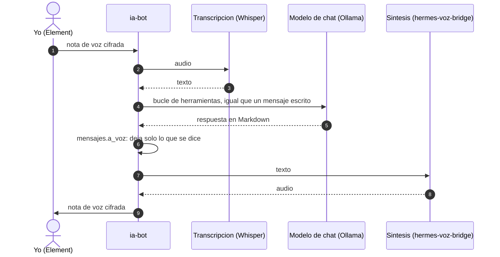

# Hermes: voz

Si le mando a Hermes una nota de voz, contesta con otra nota de voz; si le
escribo, contesta por escrito. Todo se procesa en local: la transcripcion y la
sintesis corren en mi PC, igual que el modelo de chat.

## Recorrido de un audio

## Cuando algo falla

- Si la transcripcion no esta disponible, contesto por texto que no he podido
  transcribir.
- Si el modelo no esta disponible, la pregunta se encola y la respuesta llega
  en audio cuando vuelve.
- Si la sintesis falla, mando la respuesta por texto con formato.
- Si falla la voz principal (Kokoro), el bridge usa Piper como respaldo.

## Piezas

- `ansible/roles/ia_asistente/files/voice_client.py`: cliente de transcripcion
  y sintesis del bot.
- `ansible/roles/ia_asistente/files/mensajes.py` (`a_voz`): convierte el
  Markdown en texto para leer en voz alta.
- `scripts/pc/`: el servidor de sintesis que corre en mi PC y su drop-in
  de systemd.
